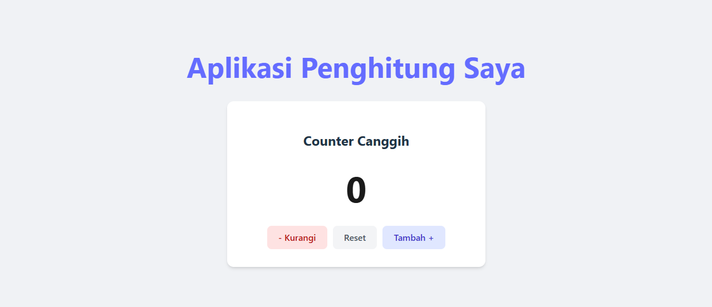

# React Counter App


Aplikasi Counter modern yang dibangun sebagai proyek pembelajaran transisi dari PHP ke React.

## 🚀 Live Demo
**[Lihat Aplikasi Langsung](https://kangnova.github.io/react-counter-app-learning/)**


*(Silakan ganti gambar ini dengan screenshot aplikasi Anda sendiri)*

## 📚 Fitur
*   **Zero Refresh**: Interaktivitas instan tanpa reload halaman (Client Side Rendering).
*   **State Management**: Menggunakan `useState` hooks.
*   **Modern UI**: Styling dengan CSS Modules dan Shadow DOM effects.
*   **Controls**: Tambah, Kurangi, dan Reset.

## 🛠️ Teknologi
*   React 19
*   Vite 6
*   JavaScript (ES6+)
*   CSS3

## 📦 Instalasi Lokal

Jika Anda ingin menjalankan proyek ini di komputer Anda:

```bash
# Clone repository
git clone https://github.com/kangnova/react-counter-app-learning.git

# Masuk ke folder
cd react-counter-app-learning

# Install dependencies
npm install

# Jalankan server
npm run dev
```

---
Dibuat dengan ❤️ oleh **Kang Nova**
(Mentored by Antigravity AI)
